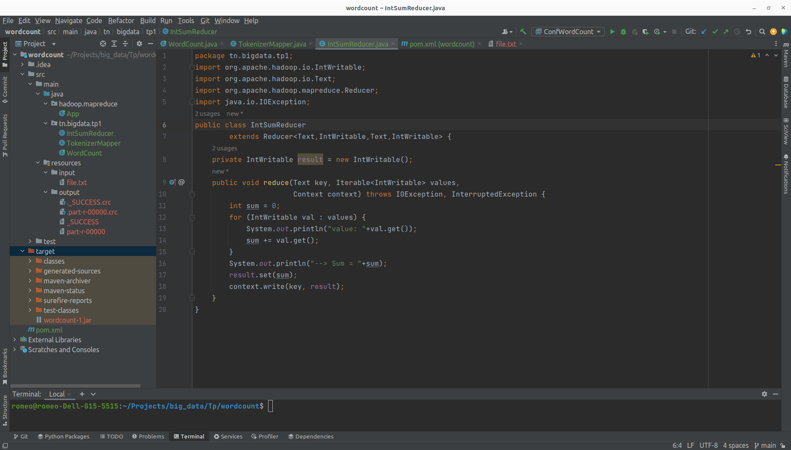

## Traitement Batch avec Hadoop HDFS et Map Reduce

### Tools
- Apache Hadoop Version: 2.7.2.
- Java Version 1.8
- Docker version 24.0.7

```bash
## Télécharger l'image docker
docker pull totofunku/bigdata-cours:latest
## Création de réseau bridge pour les trois conteneurs
docker network create --driver=bridge hadoop
```

### Créer et lancer les trois contenaires (1 main et 2 suiveurs)


```bash
## Entrer dans le contenaire main
docker exec -it hadoop-master bash
## Lancer hadoop et yarn avec le fichier suivant
/start-hadoop.sh
```


```bash
## Création du répertoire dans HDFS
hdfs dfs –mkdir -p input
## Copie du fichier purchases dans le répertoire input
hdfs dfs –put purchases.txt input
```


### Interface de visualisation des Jobs sur l'adresse http://localhost:8088


### Création de projet java avec maven


<hr>

## Ajout de code Map et Reduce

### Ajout du mapper


### Ajout du reducer


### Ajout de la classe main


### Utilisation de fichier pour tester le code


### Création d'une configuration de type Application


###Exécution du code avec le cluster hadoop


<hr>

## Écriture de job map reduce pour déterminer le total des ventes par magasin

### Code du mapping


### code du reducer


### Résultat d'execution du code sur le cluster
